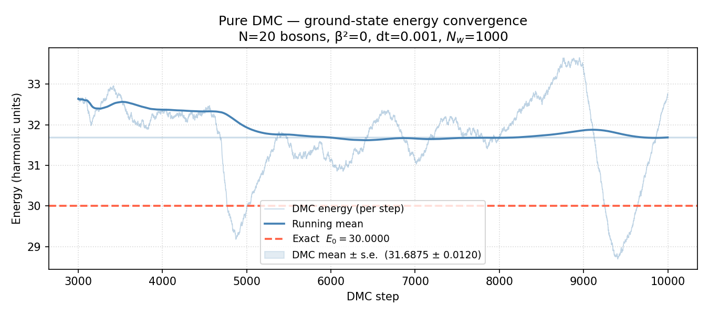
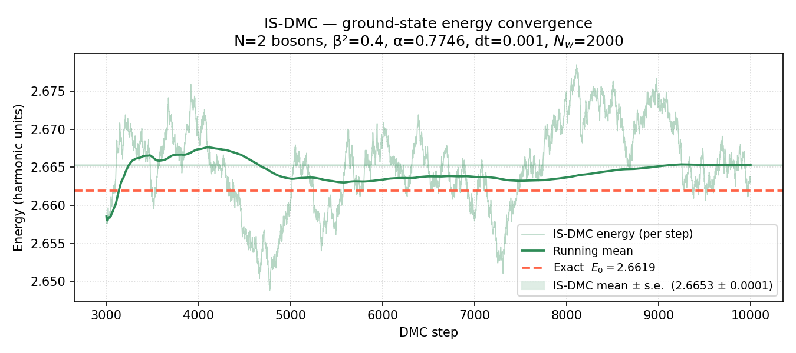

# Diffusion Monte Carlo for Interacting Bosons in a Harmonic Trap

Ground-state energy of **N interacting bosons** in a harmonic trap, computed via the **Diffusion Monte Carlo (DMC)** method.
Two implementations are provided and compared against the analytical solution.

> **Note:** The branching scheme requires the potential to be bounded below.
> The model is not suitable for potentials that diverge to $-\infty$.

---

## Physical Model

The system is governed by the Hamiltonian

$$
\hat{H} = -\frac{1}{2}\sum_{k=1}^{N}\nabla^2_{\mathbf{r}_k}
         + \frac{1}{2}\sum_{k=1}^{N}r_k^2
         - \frac{\beta^2}{2N}\sum_{l>k}|\mathbf{r}_k - \mathbf{r}_l|^2
$$

| Symbol | Meaning |
|--------|---------|
| $N$    | number of bosons |
| $\beta^2$ | interaction strength ($0 \le \beta^2 < 1$) |

The **exact ground-state energy** is

$$
E_0 = \frac{3}{2}\left[1 + (N-1)\sqrt{1-\beta^2}\right]
$$

---

## Methods

### Pure DMC — `PureDMC.py`

The imaginary-time Schrödinger equation

$$
\frac{\partial\Psi}{\partial\tau} = -(\hat{H} - E_T)\,\Psi
$$

is simulated as a stochastic diffusion-and-branching process on a population of **walkers**.
Each step consists of:

1. **Diffusion** — Gaussian displacement $\Delta\mathbf{r} \sim \mathcal{N}(0,\,dt)$
2. **Branching** — walkers are replicated or removed with weight  
   $w = \exp\!\left(-\tfrac{dt}{2}(V_\text{old}+V_\text{new}-2E_T)\right)$
3. **Population control** — the reference energy $E_T$ is adjusted to keep the walker count near the target

### Importance-Sampling DMC — `ImportanceSamplingDMC.py`

A Gaussian trial wavefunction

$$
\Psi_T(\mathbf{r}) \propto \exp\!\left(-\frac{\alpha}{2}\sum_k r_k^2\right), \qquad \alpha = \sqrt{1-\beta^2}
$$

guides the walkers via a **drift-diffusion** update

$$
\mathbf{r} \leftarrow \mathbf{r} + \mathbf{F}\,dt + \boldsymbol{\xi}, \qquad \mathbf{F} = -\alpha\,\mathbf{r}
$$

and replaces the bare potential with the **local energy** estimator

$$
E_L = \Psi_T^{-1}\,\hat{H}\,\Psi_T
$$

which has lower variance near the exact ground state.

---

## Results

Each script saves a convergence plot when executed:

| Script | Output plot |
|--------|-------------|
| `PureDMC.py` | `pure_dmc_convergence.png` |
| `ImportanceSamplingDMC.py` | `is_dmc_convergence.png` |

Each plot shows:
- DMC energy per step (faint trace)
- Running mean (solid line)
- Exact value $E_0$ (dashed red line)
- Final mean ± standard error (shaded band)


*Pure DMC — energy convergence (N=20, β²=0)*


*Importance-Sampling DMC — energy convergence (N=2, β²=0.4)*

Both methods reproduce the analytical ground-state energy.
Importance sampling converges faster and with lower variance, especially as $N$ or $\beta^2$ increases.

---

## Requirements

```
numpy
numba
matplotlib
```

```bash
pip install numpy numba matplotlib
```

---

## Usage

```bash
# Pure DMC
python PureDMC.py

# Importance-Sampling DMC
python ImportanceSamplingDMC.py
```

Key parameters at the top of each file:

| Parameter    | Description |
|--------------|-------------|
| `N_PARTICLES`| number of bosons |
| `BETA2`      | interaction strength $\beta^2$ |
| `TARGET_NW`  | target walker population |
| `DT`         | time step |
| `NSTEPS`     | total DMC steps |
| `NTHERM`     | thermalisation steps (excluded from averages) |

---

## Author

**A. S. Amari**

Developed as part of the coursework for *Mathematical and Numerical Complements* —
Master's Degree in Physics: Radiation, Nanotechnology, Particles and Astrophysics, University of Granada.
