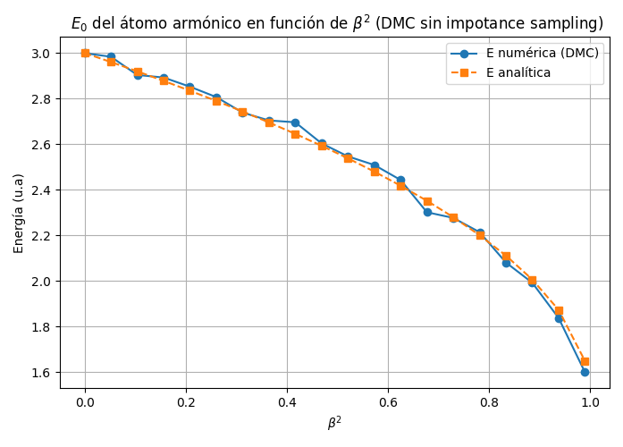
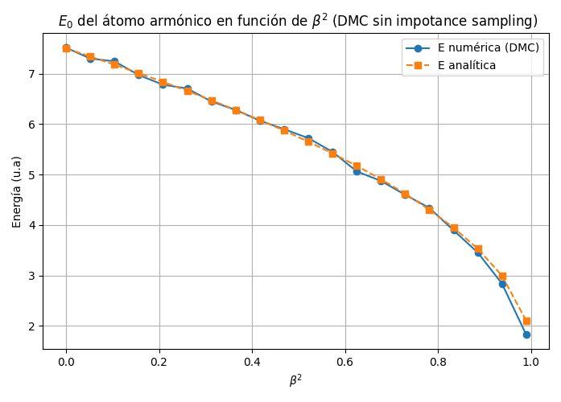
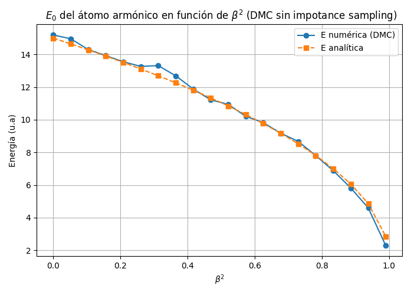
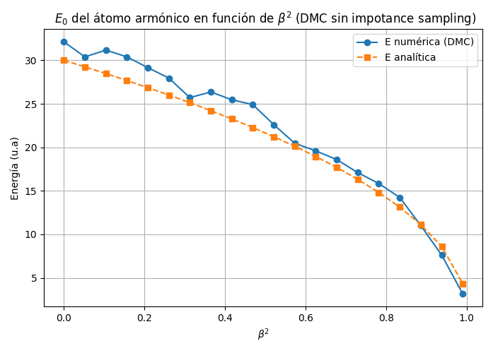
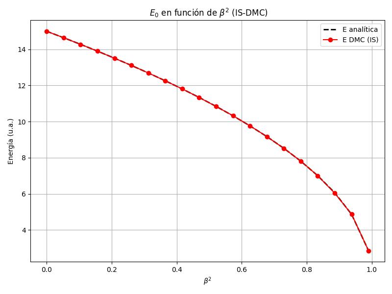
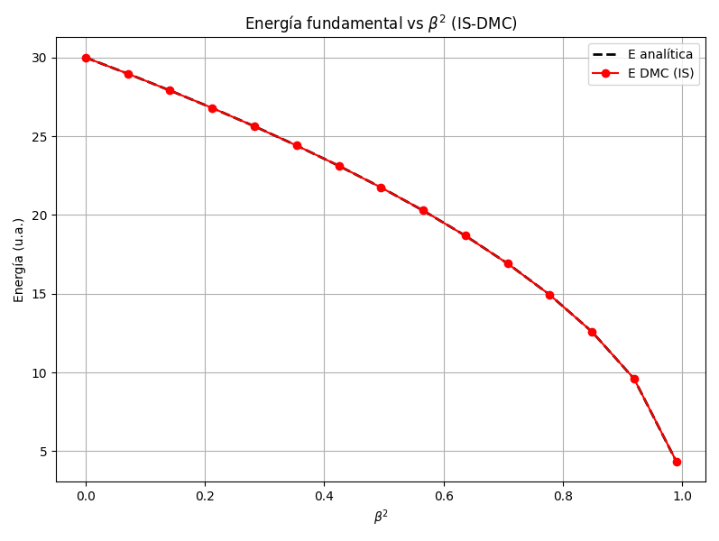
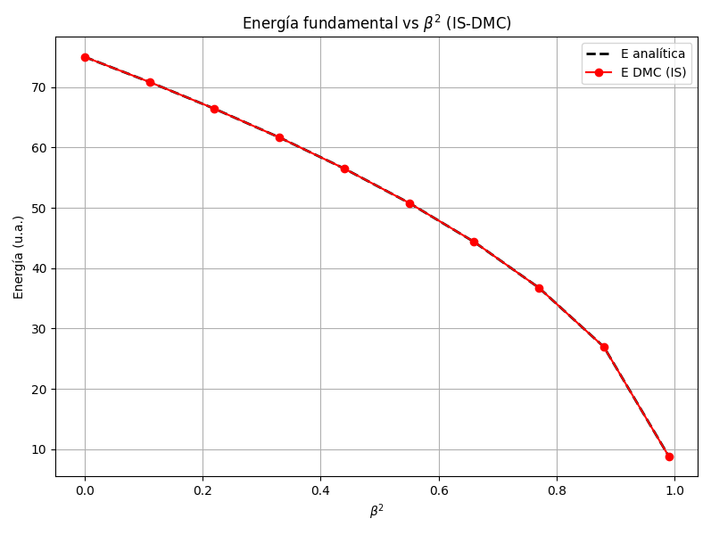
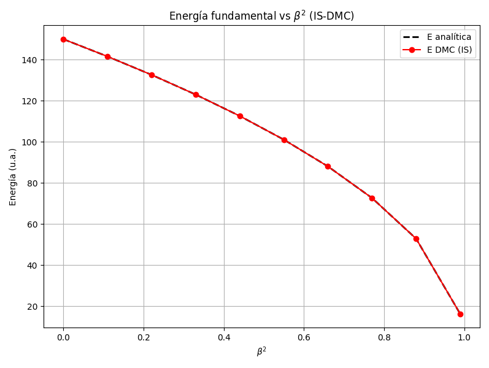

# Diffusion Monte Carlo for Interacting Bosons in a Harmonic Trap

Ground-state energy of **N interacting bosons** in a harmonic trap, computed via the **Diffusion Monte Carlo (DMC)** method.
Two implementations are provided and compared against the analytical solution.

> **Note:** The branching scheme requires the potential to be bounded below.
> The model is not suitable for potentials that diverge to $-\infty$.

---

## Physical Model

The system is governed by the Hamiltonian

$$
\hat{H} = -\frac{1}{2}\sum_{k=1}^{N}\nabla^2_{\mathbf{r}_k}
         + \frac{1}{2}\sum_{k=1}^{N}r_k^2
         - \frac{\beta^2}{2N}\sum_{l>k}|\mathbf{r}_k - \mathbf{r}_l|^2
$$

| Symbol | Meaning |
|--------|---------|
| $N$    | number of bosons |
| $\beta^2$ | interaction strength ($0 \le \beta^2 < 1$) |

The **exact ground-state energy** is

$$
E_0 = \frac{3}{2}\left[1 + (N-1)\sqrt{1-\beta^2}\right]
$$

---

## Methods

### Pure DMC — `PureDMC.py`

The imaginary-time Schrödinger equation $\partial_\tau\Psi = -(\hat{H}-E_T)\Psi$ is
simulated as a diffusion-and-branching process on a population of **walkers**:

1. **Diffusion** — Gaussian displacement $\Delta\mathbf{r} \sim \mathcal{N}(0,\,dt)$
2. **Branching** — walkers replicated/removed with weight $e^{-\frac{dt}{2}(V_\text{old}+V_\text{new}-2E_T)}$
3. **Population control** — $E_T$ adjusted to keep walker count near target

### Importance-Sampling DMC — `ImportanceSamplingDMC.py`

A Gaussian trial wavefunction $\Psi_T \propto e^{-\frac{\alpha}{2}\sum r_k^2}$,
with $\alpha = \sqrt{1-\beta^2}$, guides the walkers via drift-diffusion:

$$\mathbf{r} \leftarrow \mathbf{r} - \alpha\,\mathbf{r}\,dt + \boldsymbol{\xi}$$

Branching uses the **local energy** $E_L = \Psi_T^{-1}\hat{H}\Psi_T$ instead of the
bare potential, which reduces variance significantly.

---

## Results

### Pure DMC — $E_0$ vs $\beta^2$

<p align="center">


</p>
<p align="center">


</p>

Pure DMC agrees well with the exact solution for small $N$.
For $N=20$ the error grows due to inefficient sampling of the larger configuration space.

### Importance-Sampling DMC — $E_0$ vs $\beta^2$

<p align="center">


</p>
<p align="center">


</p>

IS-DMC reproduces the analytical solution to high accuracy across the full range of
$\beta^2$, even for $N=100$.

---

## Report

The full academic report is available in two languages:

| File | Description |
|------|-------------|
| [MemoryEN.pdf](MemoryEN.pdf) | English version — derivation of the DMC propagator, importance sampling, results |
| [MemoriaES.pdf](MemoriaES.pdf) | Spanish version (original) |

The LaTeX sources are in the [`latex/`](latex/) folder together with the bibliography.

---

## Repository Structure

```
.
├── PureDMC.py                  # Pure DMC simulation
├── ImportanceSamplingDMC.py    # IS-DMC simulation
├── generate_plots.py           # Sweep beta^2 and reproduce result figures
├── MemoryEN.pdf                # Academic report (English)
├── MemoriaES.pdf               # Academic report (Spanish, original)
├── latex/
│   ├── MemoryEN.tex            # LaTeX source (English)
│   ├── MemoriaES.tex           # LaTeX source (Spanish)
│   └── bibliografiaDMC.bib     # Bibliography
├── escudoUGRmonocromo.png      # UGR logo (required to compile .tex)
├── figures/                    # All output figures
│   ├── E0DMCPuroN{2,5,10,20}.png
│   ├── E0DMCISN{2,5,10,20,50,100}.png
│   ├── pure_dmc_convergence.png
│   └── is_dmc_convergence.png
└── LICENSE
```

---

## Requirements

```
numpy  numba  matplotlib
```

```bash
pip install numpy numba matplotlib
```

---

## Usage

```bash
# Single run — prints energy and saves convergence plot to figures/
python PureDMC.py
python ImportanceSamplingDMC.py

# Full beta^2 sweep — reproduces the result figures
python generate_plots.py
```

Key parameters at the top of each file:

| Parameter    | Description |
|--------------|-------------|
| `N_PARTICLES`| number of bosons |
| `BETA2`      | interaction strength $\beta^2$ |
| `TARGET_NW`  | target walker population |
| `DT`         | time step |
| `NSTEPS`     | total DMC steps |
| `NTHERM`     | thermalisation steps (excluded from averages) |

---

## Author

**A. S. Amari**

Developed as part of the coursework for *Mathematical and Numerical Complements* —
Master's Degree in Physics: Radiation, Nanotechnology, Particles and Astrophysics,
University of Granada.
